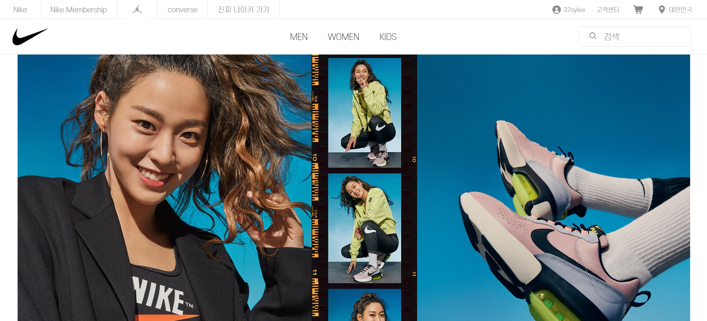
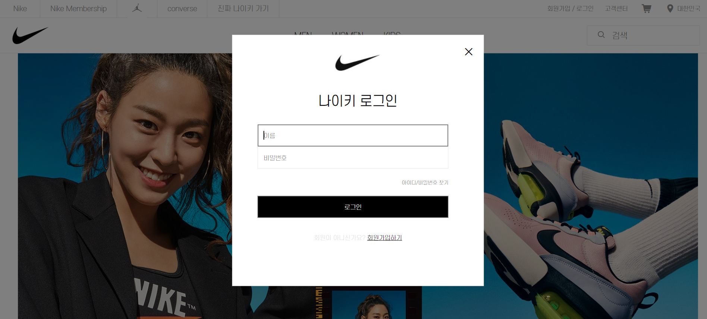
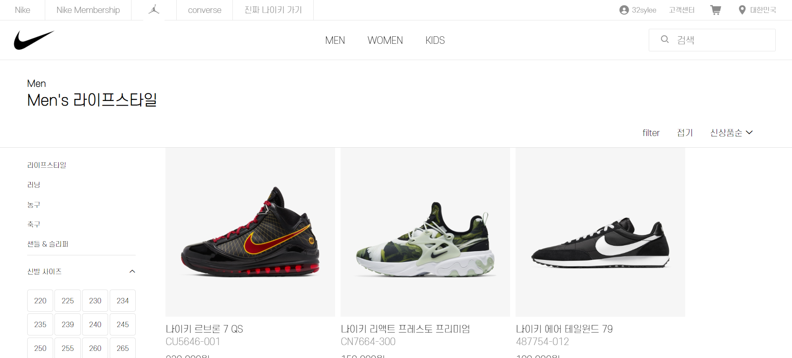
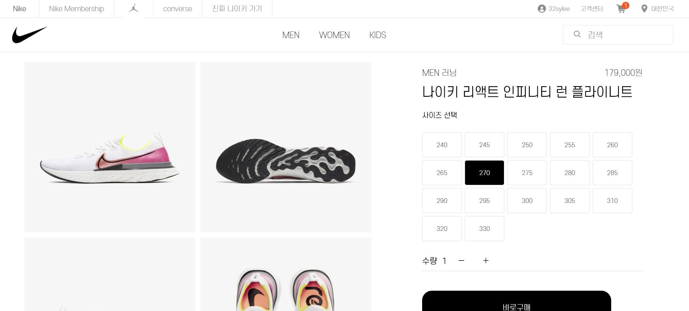

# Django Clone Project
> 나이키 공식 온라인 스토어 클론 코딩 프로젝트

이 프로젝트는 나이키 공식 온라인스토어(https://www.nike.com/kr/ko_kr/)의 클론 코딩 프로젝트입니다. 팀원 모두가 Django 프로젝트가 처음이었고 한 달이라는 제한된 기간 내에 완수하는 것을 목표로 했기 때문에 신발 카테고리만을 선정해 구현하였습니다.

## 팀원

**front** 김민수

**back** 이수연, 김초혜, 변형욱

## 사용 기술

- front : HTML5, CSS3, JavaScript, JQuery

- back : Python3, django2.x, Ajax

그 외 버전관리에는 Git, DB는 Django에 내장된 ORM을 사용하였으며 웹 크롤링을 통해 나이키 웹 사이트의 상품 정보, 이미지를 추출해 테스트 데이터로 넣었습니다.

## 프로젝트 구조

프로젝트는 3가지 app으로 구성됩니다.

- member : 로그인, 회원가입, 마이페이지

- order : 상품 주문, 배송지 관리

- product : 홈 화면, 상품 목록, 상품 필터링, 장바구니

## 프로젝트 페이지 구성

### 메인 페이지

### 회원가입 & 로그인

회원가입 후 로그인을 하면 나이키의 서비스들을 이용할 수 있습니다.

### 상품 목록

좌측의 메뉴에서 카테고리를 선택할 수 있으며, 사이즈를 선택하면 특정 사이즈 재고가 존재하는 상품을 필터링해서 보여줍니다.

## 상품 상세

좌측의 메뉴에서 카테고리를 선택할 수 있으며, 사이즈를 선택하면 특정 사이즈 재고가 존재하는 상품을 필터링해서 보여줍니다.