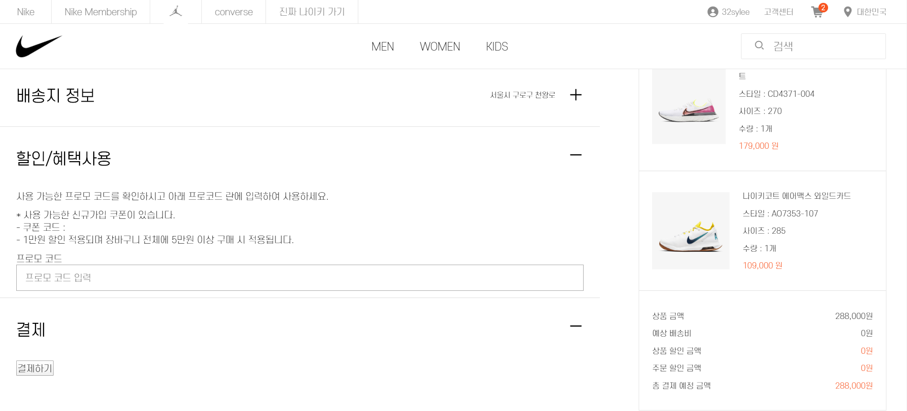

# Django Clone Project
> 나이키 공식 온라인 스토어 클론 코딩 프로젝트

이 프로젝트는 나이키 공식 온라인스토어(https://www.nike.com/kr/ko_kr/)의 클론 코딩 프로젝트입니다. 팀원 모두가 Django 프로젝트가 처음이었고 한 달이라는 제한된 기간 내에 완수하는 것을 목표로 했기 때문에 신발 카테고리만을 선정해 구현하였습니다.

## 사용 기술

- front : HTML5, CSS3, JavaScript, JQuery

- back : Python3, django2.x, Ajax

그 외 버전관리에는 Git, DB는 Django에 내장된 ORM을 사용하였으며 웹 크롤링을 통해 나이키 웹 사이트의 상품 정보, 이미지를 추출해 테스트 데이터로 넣었습니다.

## 실행 방법 (Windows)

프로젝트 폴더(django-nike) 위치에서 아래의 명령어를 실행합니다.

#### 가상환경 생성 및 실행

> python -m venv ${가상환경명}

> ${가상환경명}\Scripts\activate.bat

#### install packages

> pip install django
> pip install pillow

#### DB migrations

> python manage.py makemigrations product order member

> python manage.py migrate

#### 서버 구동

> python manage.py runserver

## 프로젝트 구조

프로젝트는 3가지 app으로 구성됩니다.

- member : 로그인, 회원가입, 마이페이지

- order : 상품 주문, 배송지 관리

- product : 홈 화면, 상품 목록, 상품 필터링, 장바구니

## 프로젝트 페이지 구성

### 메인 페이지

### 회원가입 & 로그인

회원가입 후 로그인을 하면 나이키의 서비스들을 이용할 수 있습니다.

### 상품 목록

좌측의 메뉴에서 카테고리를 선택할 수 있으며, 사이즈를 선택하면 특정 사이즈 재고가 존재하는 상품을 필터링해서 보여줍니다.

### 상품 상세

상품의 수량과 사이즈를 선택해서 주문할 수 있습니다.
재고가 없는 사이즈는 선택할 수 없도록 비활성화됩니다.
수량은 제품 재고량을 초과해서 선택할 수 없도록 만들어주었습니다.
바로구매하거나 장바구니에 담을 수 있습니다.

### 베스트 상품 모아보기

카테고리 별로 판매량이 가장 높은 5가지 상품을 보여줍니다.

### 장바구니

장바구니에 있는 상품을 주문할 수 있으며, 장바구니에서 상품을 삭제하거나 옵션을 변경할 수 있습니다.

### 주문하기

상품을 주문하는 페이지입니다.
배송지 정보는 미리 등록된 주소가 있으면 불러올 수 있습니다.
미리 등록된 주소가 없다면 신규 등록할 수 있습니다.

연습 프로젝트이기 때문에 결제까지는 구현하지 않고 결제하기 버튼을 클릭하면 주문이 완료되도록 하였습니다.

주문완료 처리를 할 때에는 재고 확인, 품절 표시, 판매량 증가 작업을 먼저 한 뒤, 최종적으로 주문이 완료됩니다. 이 과정에서 재고가 부족해서 주문이 완료되지 않거나 기타 에러사항이 발생한다면 그 전까지 수행한 모든 작업들을 롤백 시켜야 합니다. 따라서 주문완료 처리를 하는 절차는 atomic하게 구현하였습니다.

### 주문내역

상품 주문이 끝나면 주문 내역을 확인할 수 있습니다.

## 프로젝트가 끝나고 느낀 점

지금까지 혼자 개발을 해오다가 처음으로 팀원들과 함께 하는 프로젝트를 진행했다. 협업이기 때문에 Git을 적극적으로 이용하였는데 덕분에 fork, branch 등 Git의 여러 기능들을 경험해볼 수 있어서 좋은 경험이었다.

Django로 프로젝트를 하면서 Django에서 기본적으로 제공하고 있는 기능이 많다는 것을 느꼈다. 가장 편리하고 강력한 기능이라 생각한 것은 admin 페이지였는데, 따로 admin 페이지를 만들 필요 없이 Django에서 제공하는 admin 페이지를 통해 손쉽게 데이터베이스의 데이터들을 추가, 삭제, 수정할 수 있었다.

가장 크게 느낀 점은 사전에 설계를 탄탄하게 해 놓는게 중요하다는 것이다. 실제로 웹 페이지가 돌아가기 위해서는 수 많은 데이터들이 서로 맞물려 돌아가야 한다. 개발 도중에 데이터 구조를 수정하게 되면 다른 코드에 문제가 생길 여지가 아주 많다. 그러므로 다소 지루하더라도 페이지 및 데이터 설계를 미리 치밀하게 해 주는게 좋을 것 같다.
